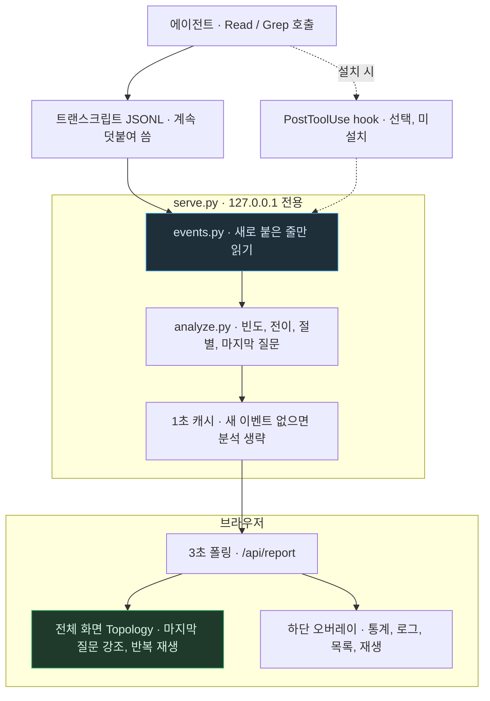

# DevelopPrompt 규약 참조 애널리틱스 — 이벤트가 화면에 닿기까지

> `DevelopPrompt-Analytics.md`의 별첨 플로우차트. 작성 규칙은
> `DevelopPrompt/Unity/VISUALIZE_RULE/04_MERMAID_STYLE.md`를 따른다.
> 기준 시점: 2026-10-09

**읽는 법**: 위에서 아래로 데이터가 흐른다. 에이전트가 도구를 호출하면 Claude Code가 그 사실을
트랜스크립트에 덧붙인다(실선). hook 경로(점선)는 설치했을 때만 생기는 두 번째 입구다. 서버 안에서는
`events.py`가 파일마다 읽은 위치를 기억해 새 줄만 이벤트로 바꾸고, 분석 결과는 1초 동안 재사용된다.
브라우저는 3초마다 결과를 받아 Topology와 오버레이를 함께 갱신한다.

**핵심 한 줄**: 실시간의 비결은 빠른 전송이 아니라 "새로 붙은 줄만 읽는다"는 증분 읽기다.
