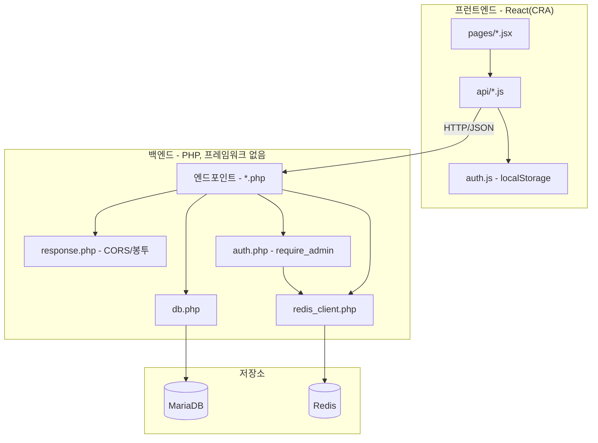

# RottenNoble-Project — 레이어는 누구를 참조하나

> `RottenNoble-Project.md`의 별첨 플로우차트. 작성 규칙은
> `DevelopPrompt/Unity/VISUALIZE_RULE/04_MERMAID_STYLE.md`를 따른다.
> 기준 시점: 2026-09-08

**읽는 법**: 화살표는 "안다 / 호출한다". `PAGE`는 `API`만 알고 `EP`를 직접 모른다 — 통신은 항상
`api/*.js` 계층을 거친다. 백엔드 쪽도 마찬가지로 `EP`가 `RESP`/`GUARD`/`DBPHP`/`REDISPHP`를
직접 호출하고, 그 아래 실제 저장소(`MARIA`/`REDIS`)는 각각 전용 접근 코드를 통해서만 닿는다.

**핵심**: 백엔드와 프런트엔드가 서로 다른 언어인데도 "엔드포인트/페이지 하나는 얇게 두고, 공통
관심사(CORS·인증·요청 헬퍼)만 별도 파일로 뽑는다"는 같은 구조 원칙을 대칭적으로 따르고 있다.
