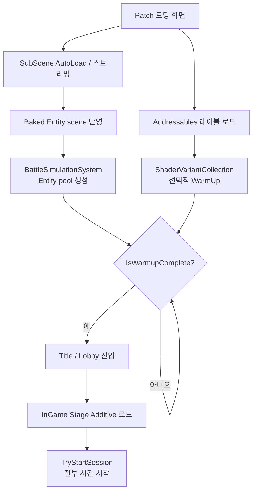

# TD_Project ECS Warm-up — 준비 단계의 순서

> `TD_Project-ECS-Warmup.md`의 별첨 플로우차트다. 기준 시점: 2026-09-15

**읽는 법**: Addressables와 SubScene 스트리밍은 서로 독립적으로 시작할 수 있지만, 전투를
시작하는 조건은 단순한 Addressables 완료가 아니다. baked Entity가 월드에 반영되고
`BattleSimulationSystem`이 풀을 만든 뒤 `IsWarmupComplete`가 true가 되어야 Patch가 준비를
끝낸다. 셰이더 Warm-up은 이 흐름과 병렬로 진행되며, 실제 GPU render-state 준비는 별도의
플랫폼 검증 단계다.

**핵심**: `loaded`(읽을 수 있음), `ready`(풀을 쓸 수 있음), `started`(전투 시간이 흐름)를
서로 다른 상태로 취급한다.
