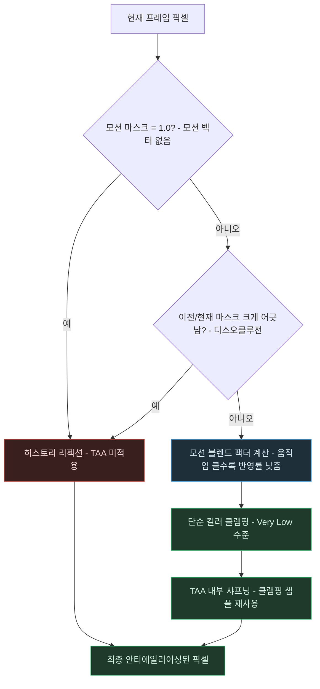

# 커스텀 TAA — 픽셀 하나가 히스토리 리젝션을 거치는 흐름

> `Custom-TAA.md`의 별첨 플로우차트. 작성 규칙은
> `DevelopPrompt/Unity/VISUALIZE_RULE/04_MERMAID_STYLE.md`를 따른다.
> 기준 시점: 2026-09-09

**읽는 법**: 두 개의 판정(`MASK`, `DISOCC`)이 "이 픽셀의 히스토리를 믿을 수 있는가"를 순서대로
걸러낸다. 둘 중 하나라도 걸리면 곧장 `REJECT`로 빠져 이번 프레임 색을 그대로 쓰고, 둘 다
통과한 픽셀만 모션 블렌드 → 컬러 클램핑 → 샤프닝을 거친다.

**핵심**: TAA의 정교함은 "얼마나 좋은 블러/클램핑 알고리즘을 쓰는가"보다 "애초에 TAA를 적용하면
안 되는 픽셀을 얼마나 정확히 걸러내는가"에서 더 크게 갈린다 — 이 사례가 컬러 클램핑 자체는
가장 단순한 알고리즘을 쓰면서도 품질을 지킬 수 있었던 이유가 바로 앞단의 리젝션 판정이 이미
문제 픽셀 대부분을 걸러줬기 때문이다.
