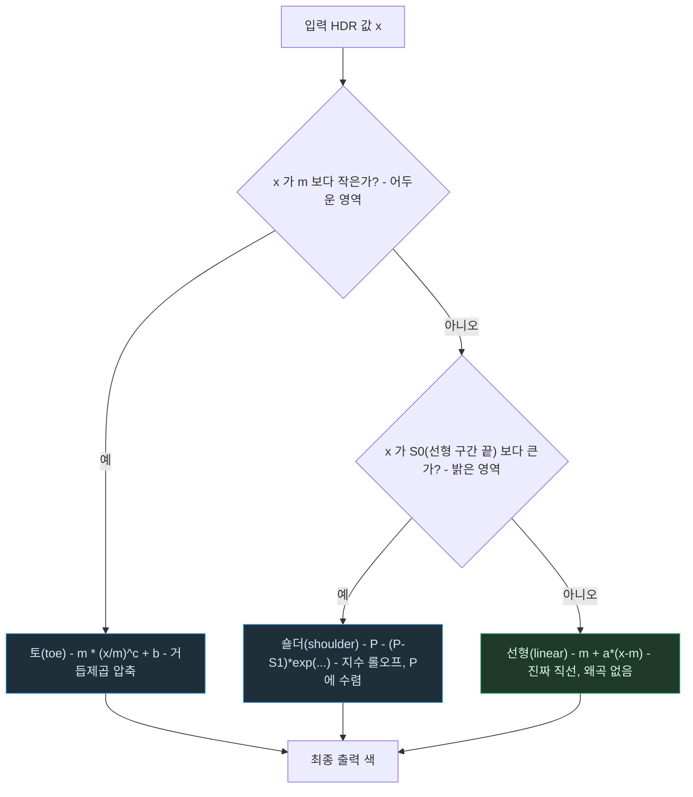

# GT 톤매퍼 — 입력값이 세 구간 중 어디로 가는가

> `GT-Tonemapping.md`의 별첨 플로우차트. 작성 규칙은
> `DevelopPrompt/Unity/VISUALIZE_RULE/04_MERMAID_STYLE.md`를 따른다.
> 기준 시점: 2026-09-09

**읽는 법**: 두 개의 판정(`LT`, `GT`)이 입력값을 토/선형/숄더 세 구간으로 나눈다. 실제 셰이더
코드에서는 이 분기를 `if`가 아니라 `smoothstep`/`step` 기반 가중치 블렌딩으로 처리해서, 구간
경계에서 값이 뚝 끊기지 않고 매끄럽게 이어진다 — 이 그림은 "어느 구간의 수식이 지배적으로
작용하는가"를 이해하기 위한 단순화다.

**핵심**: 파라미터 `m`(선형 구간 시작)과 `l`(선형 구간 길이)이 이 세 구간의 경계 자체를
움직인다 — 즉 GT 톤매퍼를 튜닝한다는 건 이 플로우차트의 분기 조건 자체를 바꾸는 일과 같다.
ACES/Reinhard처럼 곡선 모양이 고정된 톤매퍼에는 애초에 이런 분기 자체가 없다.
