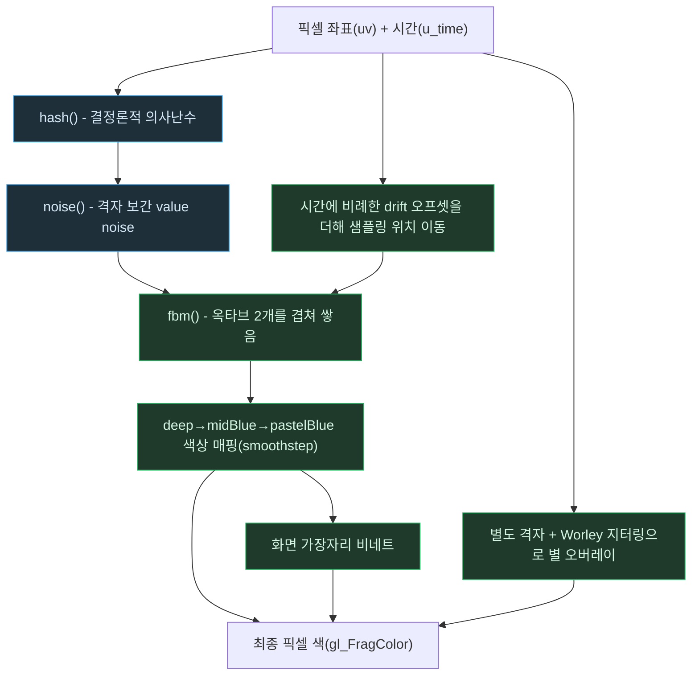

# 절차적 배경 셰이더 — 픽셀 한 점이 색으로 나오기까지

> `Procedural-Noise-Shaders.md`의 별첨 플로우차트. 작성 규칙은
> `DevelopPrompt/Unity/VISUALIZE_RULE/04_MERMAID_STYLE.md`를 따른다.
> 기준 시점: 2026-09-10

**읽는 법**: 왼쪽 경로(파랑)는 "무작위 값을 어떻게 만드는가"를 다루는 재료 단계이고, 초록
경로는 그 재료로 실제 화면에 보이는 결과를 조립하는 단계다. `FBM`은 매 프레임 `drift`만큼
다른 위치를 샘플링하기 때문에 같은 계산 경로를 타면서도 결과가 시간에 따라 달라진다. `STAR`는
`FBM`과 완전히 독립된 별도의 격자·별도의 hash 시드를 쓰기 때문에, 성운의 흐름과 별의 반짝임이
서로 다른 리듬으로 움직여도 어색하지 않다.

**핵심**: 절차적 셰이더는 "무작위처럼 보이는 결정론적 함수(hash)"에서 시작해, 그 함수를
보간(noise)하고 겹쳐 쌓고(fbm) 시간에 따라 이동시키는(drift) 몇 단계만으로 텍스처 자산 없이
움직이는 배경 전체를 만들어낸다 — 각 단계는 이전 단계의 결과에 값싼 연산 하나를 더하는
것뿐이라, 전체 비용은 옥타브 수 같은 소수의 손잡이로 선형적으로 조절된다.
