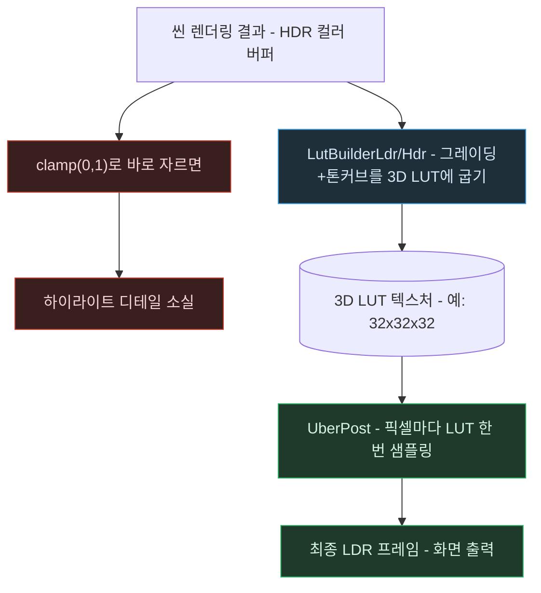

# 톤 매핑 — HDR 픽셀 하나가 화면에 찍히기까지

> `Tone-Mapping.md`의 별첨 플로우차트. 작성 규칙은
> `DevelopPrompt/Unity/VISUALIZE_RULE/04_MERMAID_STYLE.md`를 따른다.
> 기준 시점: 2026-09-09

**읽는 법**: 위쪽 경로(빨간 노드)는 톤 매핑 없이 그냥 잘라내는 경우, 아래쪽 경로(파랑→초록)가
실제 URP가 쓰는 경로다. `BAKE` 단계는 프레임당 딱 한 번, 작은 LUT 텍스처 하나에 대해서만
일어나고, `SAMPLE` 단계는 화면 해상도만큼(예: 200만 픽셀) 반복되지만 각 픽셀은 값비싼 곡선
수식이 아니라 텍스처 조회 한 번만 하면 된다.

**핵심**: 톤 매핑 수식 자체는 무겁지 않더라도, "화면의 모든 픽셀마다 그 수식을 매번 계산할
것인가, 작은 표 하나로 미리 구워둘 것인가"가 실제 성능을 가르는 결정이다 — LUT 방식은 계산
횟수를 (해상도) → (LUT 해상도)로 줄이는 고전적인 시간-공간 트레이드오프다.
