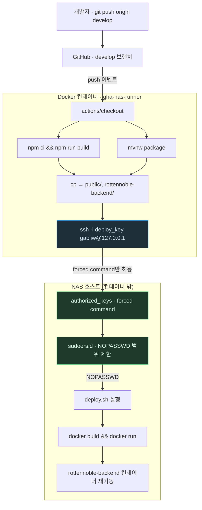

# GitHub Actions — push부터 컨테이너 재기동까지, 어느 경계를 넘나드나

> `GitHub-Actions.md`의 별첨 플로우차트. 작성 규칙은
> `DevelopPrompt/Unity/VISUALIZE_RULE/04_MERMAID_STYLE.md`를 따른다.
> 기준 시점: 2026-09-10

**읽는 법**: 위쪽(`DEV`~`CP`)은 전부 **컨테이너 안**에서 일어난다 — 컨테이너의 glibc는
호스트와 무관한 최신 버전이라 여기서는 아무 문제가 없다. `SSH` 화살표가 컨테이너와 호스트의
경계를 넘는 유일한 지점이다. 그 아래(`AUTH`~`BACKEND`)는 전부 **호스트**에서 일어나고,
`AUTH`(forced command)와 `SUDO`(범위 제한 NOPASSWD)가 이 경계를 지키는 두 겹의 문이다.

**핵심**: 이 그림에서 "권한이 강한 것"(호스트의 `docker` 명령, 컨테이너 재기동)은 전부
호스트 쪽에만 있고, 컨테이너 쪽은 "이 문 하나만 두드릴 수 있다"는 사실 하나만 들고 있다.
컨테이너가 뚫려도 공격자가 얻는 건 이 그림의 `SSH` 화살표뿐 — 그 뒤(`AUTH`, `SUDO`)가
행동을 `DEPLOY` 한 가지로 이미 좁혀놨기 때문에, 컨테이너 자체의 권한 크기와 무관하게
피해 범위가 정해진다.
