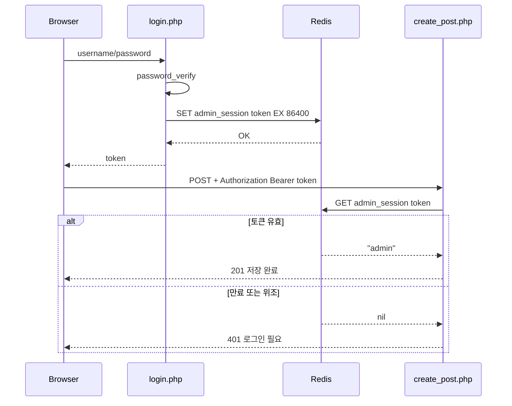

# Redis — 로그인부터 세션 만료까지, 무슨 순서로 일어나나

> `Redis.md`의 별첨 플로우차트. 작성 규칙은
> `DevelopPrompt/Unity/VISUALIZE_RULE/04_MERMAID_STYLE.md` §8(sequenceDiagram)을 따른다.
> 기준 시점: 2026-09-08

**읽는 법**: `->>`는 요청, `-->>`는 응답. `SET ... EX 86400`이 실행된 순간부터 24시간 뒤 Redis가
그 키를 자동으로 지운다 — 이 그림엔 "24시간 후" 시점이 별도로 안 나오지만, 그 시점 이후엔 `alt`의
"만료" 분기가 항상 선택된다는 뜻이다.

**핵심**: 토큰 자체는 클라이언트(브라우저)가 들고 있고, 그 토큰이 유효한지는 매 요청마다 Redis에
물어봐야 알 수 있다 — 서버(PHP)는 토큰의 유효성을 스스로 판단할 수 없고 항상 Redis가 최종 권한을
가진다. (이 지점이 [JWT-vs-Redis-Session.md](../Security/JWT-vs-Redis-Session.md)에서 JWT와 정반대로
갈리는 지점이다 — JWT라면 서명만 검증하면 되므로 이 그림의 `E->>R` / `R-->>E` 두 화살표 자체가
없어진다.)
