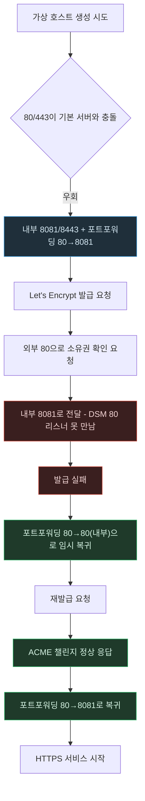

# HTTPS 인증서 발급 — 포트 우회와 ACME 챌린지가 언제 어긋났나

> `HTTPS-and-Mixed-Content.md`의 별첨 플로우차트. 작성 규칙은
> `DevelopPrompt/Unity/VISUALIZE_RULE/04_MERMAID_STYLE.md`를 따른다.
> 기준 시점: 2026-09-08

**읽는 법**: 파란 노드(`REROUTE`)가 "정상 운영을 위해 필요했던 우회"이고, 빨간 노드들은 그 우회
때문에 인증서 발급이 실패한 지점, 초록 노드들은 그걸 되돌려서 문제를 해결한 지점이다.

**핵심**: 포트 우회(`8081/8443`)는 평상시 트래픽에는 문제가 없지만, Let's Encrypt의 소유권 확인은
반드시 외부 80번이 NAS의 실제 80번으로 가야만 성립한다 — "평소엔 필요했던 설정"과 "인증서 발급
순간에만 방해가 되는 설정"이 같은 값이었다는 게 이 문제의 핵심이다.
