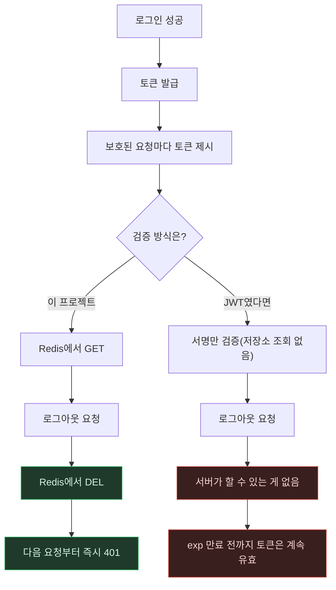

# JWT vs Redis 세션 — 즉시 무효화가 필요한 순간 무엇이 갈리나

> `JWT-vs-Redis-Session.md`의 별첨 플로우차트. 작성 규칙은
> `DevelopPrompt/Unity/VISUALIZE_RULE/04_MERMAID_STYLE.md`를 따른다.
> 기준 시점: 2026-09-08

**읽는 법**: 위쪽 절반(`SESS` 경로)이 이 프로젝트가 실제로 구현한 흐름이고, 아래쪽 절반(`SIGN`
경로)은 JWT를 골랐다면 어떻게 됐을지를 보여주는 가상의 비교 경로다. 초록 노드는 "로그아웃이
실제로 즉시 반영되는 지점", 빨강 노드는 "JWT 기본 구조에서는 막을 방법이 없는 지점"이다.

**핵심**: 두 방식의 차이는 로그인 순간이 아니라 **로그아웃(무효화) 순간**에 드러난다. 평상시
요청 처리는 둘 다 잘 동작하지만, "이 토큰을 지금 당장 죽이고 싶다"는 순간에 Redis 세션은
`DEL` 한 번으로 끝나고, 순수 JWT는 만료 시각이 될 때까지 손을 쓸 방법이 없다.
