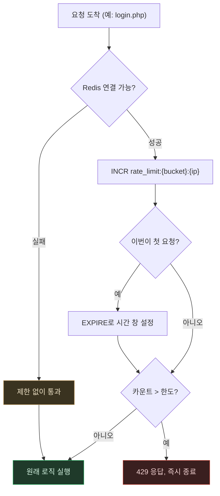

# Rate Limiting — 요청 한 건이 허용/차단으로 갈리는 흐름

> `Rate-Limiting.md`의 별첨 플로우차트. 작성 규칙은
> `DevelopPrompt/Unity/VISUALIZE_RULE/04_MERMAID_STYLE.md`를 따른다.
> 기준 시점: 2026-09-08

**읽는 법**: 왼쪽 갈래(`RC` → 실패 → `SKIP`)는 Redis 자체가 죽어있을 때의 경로다 — 이때는
제한을 아예 걸지 않고 원래 로직을 그대로 실행한다(주황 노드). 오른쪽 갈래가 정상 경로: `INCR`로
카운트를 올리고, 첫 요청이면 시간 창을 설정한 뒤, 한도를 넘었는지 확인해서 넘었으면 즉시 429로
끊고(빨강), 아니면 원래 로직으로 넘어간다(초록).

**핵심**: "Redis가 없으면 통과"와 "한도를 넘으면 차단"은 서로 다른 이유로 다른 결과를 낸다 —
전자는 가용성을 지키기 위한 의도적 완화(fail open)이고, 후자는 보안을 위한 의도적 차단
(fail closed)이다. 같은 함수 안에 두 가지 "실패 처리 철학"이 공존한다는 게 이 설계의 핵심이다.
