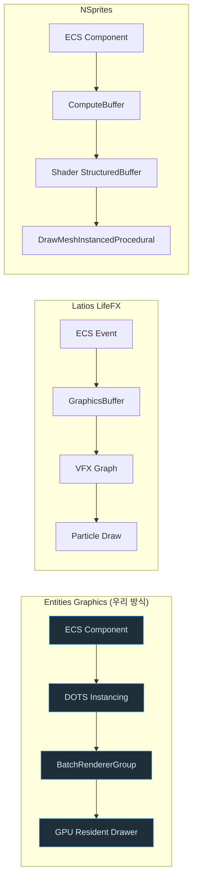

# 개체별 GPU 데이터는 어떤 경로로 렌더러까지 가는가

기준: 2026-09-17, Entities Graphics 6.4.0 / Unity 6000.4.0b11 기준.

**읽는 법**: 세 경로 모두 "ECS 개체 데이터 → GPU 버퍼 → 그리기 호출"이라는 같은 문제를
풀지만, 가운데 두 단계(파란색 = 우리가 실제로 쓰는 경로)를 서로 다른 방식으로 채운다.

**핵심**: Latios는 셰이더 대신 VFX Graph에 위임하고, NSprites는 Entities Graphics 자체를
건너뛰어 버퍼를 직접 관리한다. 우리는 Entities Graphics의 표준 경로(DOTS Instancing)를 타서
Unity 6의 GPU Resident Drawer 같은 엔진 발전을 그대로 물려받는다.
