# ECS 렌더링: 데이터는 어떻게 URP까지 도달하는가

기준: 2026-09-15, Entities Graphics 1.x 개념 기준.

```mermaid
flowchart LR
    %% ── 입력과 변환 ───────────────────
    AUTH["Authoring Prefab"]
    BAKER["Baker"]
    PREFAB["Entity Prefab"]
    SIM["Simulation System"]:::hi
    DATA["Transform Data"]
    EG["Entities Graphics"]:::good
    SRP["URP Render Pass"]
    GPU["GPU Frame"]

    %% ── 관계 ──────────────────────────
    AUTH --> BAKER
    BAKER --> PREFAB
    PREFAB --> SIM
    SIM -->|"write"| DATA
    DATA --> EG
    EG -->|"batches"| SRP
    SRP --> GPU

    %% ── 스타일 ────────────────────────
    classDef good fill:#1f3a2a,stroke:#27ae60,color:#d5f5e3
    classDef hi fill:#1f2f3a,stroke:#3498db,color:#d5e8f5
```

**읽는 법**: 화살표는 데이터가 준비되어 렌더 결과로 전달되는 주 경로다.

**핵심**: Entities Graphics는 `URP Render Pass`를 대체하지 않는다. Entity 데이터를 batch로 수집해 기존 SRP가 그릴 수 있게 전달한다.

