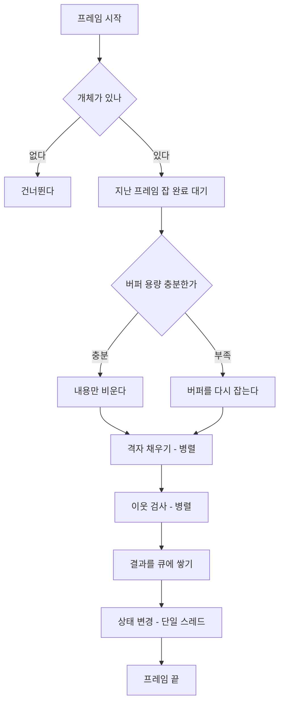

# 공간 분할 — 균일 격자와 공간 해시(Spatial Hash)로 이웃 찾기

- **카테고리**: 게임 프로그래밍, 자료구조
- **상태**: 학습 중
- **기준 시점**: 2026-09-20, Unity 6000.4 / Entities 1.x 기준
- **관련 레포지토리**: `TD_Project`
- **엔진**: `Unity`
- **상위 문서**: -

---

## 출처

`TD_Project`에서 낙하하는 적과 총알의 충돌 판정을 붙이기 직전에 나온 주제다. 그 전까지는
적이 떨어지고 화면 밖으로 나가면 회수되는 것뿐이라 "누가 누구와 만났는가"를 물어볼 일이
없었는데, 총알이 적을 맞히는 순간부터 매 프레임 수만 번의 "이 둘이 닿았나"를 판단해야
한다. 이때 아무 생각 없이 짜면 개체 수가 조금만 늘어도 프레임이 무너진다.

## 정의

공간 분할은 **넓은 공간을 여러 칸으로 미리 나눠 두고, 어떤 개체가 어느 칸에 있는지를 기록해
두는 기법**이다. 그러면 "이 개체 근처에 누가 있나"를 물을 때 전체를 뒤지지 않고 같은 칸과
바로 옆 칸만 보면 된다.

균일 격자(Uniform Grid)는 그중 가장 단순한 방식으로, 공간을 **모두 같은 크기의 정사각형
칸으로 자른다**. 칸마다 크기가 다르거나 필요에 따라 더 잘게 쪼개는 방식(쿼드트리, BVH 등)과
대비된다.

그런데 "칸을 나눈다"는 개념과 "그 칸을 어디에 저장하느냐"는 별개의 문제다. 같은 균일 격자라도
저장 방식에 따라 이름이 갈린다.

- **배열로 저장하면** 흔히 그냥 *uniform grid*라고 부른다. 칸 번호가 곧 배열 인덱스다.
- **해시 테이블로 저장하면** *spatial hash*(공간 해시)라고 부른다. 칸 번호를 해시로 접어 키로 쓴다.

즉 공간 해시는 균일 격자의 **대안이 아니라 구현 방식 중 하나**다. 둘을 나란히 놓고 "무엇을
쓸까" 고민하는 건 범주를 잘못 짚은 것이다. 뒤에서 보듯 `TD_Project`가 고른 것도 정확히는
**균일 격자를 공간 해시로 구현한 것**이다.

## 요약

개체가 n개일 때 서로의 충돌을 전부 검사하면 비교 횟수가 n²에 비례한다. 개체가 1,000개면
백만 번, 10,000개면 1억 번이다. 개체 수가 10배가 되면 비용은 100배가 되므로, 스웜 전투처럼
개체가 수천에서 수만 개에 이르는 게임에서는 이 방식이 애초에 성립하지 않는다.

균일 격자는 각 개체를 자기 위치에 해당하는 칸에 등록해 두고, 검사할 때는 **자기 칸과 인접
8칸, 총 9칸**만 훑는다. 개체가 공간에 고르게 퍼져 있다면 한 칸에 들어 있는 개체 수는 평균적
으로 일정하므로, 전체 비용은 n에 비례하는 수준으로 떨어진다.

## 상세

### 왜 n²가 문제인가

충돌 판정의 본질은 "모든 쌍에 대해 거리를 재는 것"이다. 총알 5,000발과 적 50,000마리가
있다면 순진하게 짤 경우 5,000 × 50,000 = 2억 5천만 번의 거리 계산이 매 프레임 일어난다.
거리 계산 자체는 뺄셈 세 번과 곱셈 세 번 정도로 아주 싸지만, 2억 5천만 번이면 아무리
싸도 감당할 수 없다.

여기서 중요한 사실은 **그 계산의 절대다수가 헛수고**라는 점이다. 화면 왼쪽 끝의 총알과
오른쪽 끝의 적은 닿을 가능성이 전혀 없는데도 거리를 재고 있다. 공간 분할은 이 "가능성이
없는 쌍"을 계산하기 전에 걸러내는 기법이다.

### 칸에 넣기: 좌표를 칸 번호로 바꾸기

어떤 개체가 어느 칸에 속하는지는 위치를 칸 크기로 나누고 내림하면 바로 나온다. 칸 크기가
2라면 위치 (5.3, -1.2)는 5.3 ÷ 2 = 2.65 → 2, -1.2 ÷ 2 = -0.6 → -1 이므로 (2, -1)번 칸이다.

```
칸 번호 = floor(위치 / 칸 크기)
```

내림(floor)을 쓰는 게 중요하다. 정수 변환(truncate)을 쓰면 음수 영역에서 -0.6이 0이 되어
칸 하나가 두 배로 넓어지고 경계가 어긋난다.

### 칸 번호를 어떻게 저장할까: 해시의 등장

칸 번호가 정해졌다면 "이 칸에 속한 개체 목록"을 어딘가에 담아야 한다. 가장 단순한 방법은
2차원 배열을 만드는 것이다. 하지만 이 방법은 **공간의 범위를 미리 못 박아야 한다**는 제약이
따른다. 개체가 그 범위를 벗어나면 배열 바깥을 건드리게 되므로, 경계를 벗어난 개체를 따로
처리하거나 배열을 넉넉하게 잡아야 한다.

그래서 흔히 쓰는 방식이 **공간 해시(spatial hash)** 다. 칸 번호 (x, y)를 하나의 정수로 접어서
해시 테이블의 키로 쓴다.

```
해시 = hash(칸번호)
```

이러면 공간의 범위를 미리 알 필요가 없다. 개체가 어디로 가든 그 위치의 칸 번호를 해시로
바꿔 담으면 된다. 대신 서로 다른 칸이 우연히 같은 해시 값을 갖는 **충돌**이 생길 수 있는데,
이 경우 같은 키에 엉뚱한 칸의 개체가 섞여 들어온다. 다만 이건 정확성 문제가 아니다 —
꺼낸 뒤 어차피 실제 거리를 재기 때문에, 멀리 있는 개체는 거리 검사에서 걸러진다. 충돌이
잦으면 헛계산이 늘어 느려질 뿐이다.

Unity DOTS에서는 `NativeParallelMultiHashMap<int, T>`가 이 역할을 한다. "Multi"가 붙은 이유는
**하나의 키에 여러 값을 담을 수 있어야** 하기 때문이다. 한 칸에는 개체가 여러 개 들어가므로
일반 해시맵으로는 표현할 수 없다.

`TD_Project`가 쓰는 게 바로 이 방식이다. 즉 **균일 격자를 공간 해시로 구현**했다. 배열 대신
해시를 고른 이유는 적이 스폰 범위를 벗어나 화면 밖까지 떨어지기 때문이다. 배열이었다면
범위를 벗어난 개체를 따로 처리하거나 배열을 훨씬 넉넉하게 잡아야 했다.

### 세 번째 선택지: 정렬 기반

해시 테이블 말고 **정렬된 배열**을 쓰는 방법도 있다. 개체마다 (칸 해시, 개체 정보) 쌍을
만들어 칸 해시로 정렬하면, 같은 칸의 개체들이 메모리에 연속으로 놓인다. 그다음 이진 탐색으로
원하는 칸의 시작 위치를 찾아 순차적으로 읽는다.

이 방식의 강점은 **캐시 지역성**이다. 해시 테이블은 버킷을 따라가며 여기저기 흩어진 메모리를
읽지만, 정렬된 배열은 연속된 메모리를 쭉 읽는다. 현대 CPU에서 이 차이는 생각보다 크다.

대신 정렬 비용 O(n log n)이 붙고 구현이 복잡해진다. 그래서 보통은 해시 방식으로 시작하고,
프로파일링에서 이웃 탐색이 실제 병목으로 드러났을 때 옮겨간다.

### 칸 크기를 어떻게 정할까

이것이 균일 격자에서 가장 중요한 선택이다. 칸이 너무 작으면 개체 하나가 여러 칸에 걸치거나,
9칸을 봐도 상대를 놓친다. 칸이 너무 크면 한 칸에 개체가 잔뜩 들어가서 결국 그 안에서
n² 검사를 하는 셈이 된다.

기준은 **가장 큰 상호작용 반경**이다. 총알 반경이 0.2이고 적 반경이 0.5라면 둘이 닿는
최대 거리는 0.7이므로, 칸 크기가 0.7 이상이면 인접 9칸 안에 반드시 상대가 들어온다.

여기서 흔히 저지르는 실수는 **충돌 반경만 보고 칸 크기를 정하는 것**이다. 나중에 "가장 가까운
적을 찾아 조준한다" 같은 기능이 붙으면 탐색 반경이 충돌 반경보다 훨씬 커진다. 사거리가 12인데
칸 크기가 0.7이라면 9칸으로는 어림도 없고, 17 × 17 = 289칸을 훑어야 한다. 칸 크기는 앞으로
생길 기능까지 고려해 넉넉하게 잡는 편이 낫다.

### 왜 매 프레임 다시 만드는가

모든 개체가 매 프레임 움직이는 게임에서는 **격자를 통째로 비우고 다시 채우는 쪽이 싸다**.
개체가 칸을 옮겼는지 일일이 확인해서 옮겨 넣는 것보다, 그냥 다 지우고 새로 넣는 게 분기도
없고 병렬화도 쉽기 때문이다.

이것이 균일 격자가 쿼드트리 같은 트리 구조보다 유리한 지점이다. 트리는 한 번 만들면 검색이
빠르지만, 개체가 움직일 때마다 노드를 옮기고 트리 구조를 다시 균형 잡아야 한다. 개체가
거의 안 움직이는 정적인 장면에서는 트리가 유리하고, 전부 움직이는 동적인 장면에서는 격자가
유리하다.

다만 **매 프레임 메모리를 새로 할당하면 안 된다**. 할당과 해제 자체가 비싸기 때문에, 버퍼는
한 번 잡아 두고 내용만 비운다. 개체 수가 늘어 용량이 부족해질 때만 다시 잡는다.

### 가장 가까운 것 찾기: 링 검색

충돌 판정은 "닿았는가"만 알면 되므로 9칸만 보면 끝이다. 그런데 "가장 가까운 적"을 찾는
건 이야기가 다르다. 사거리 안에 있는 모든 칸을 다 봐야 정확한 최근접을 찾을 수 있기
때문이다.

여기서 쓰는 방법이 **링 검색**이다. 중심 칸에서 시작해 한 겹씩 바깥으로 넓혀 나가되,
후보를 찾으면 곧 멈춘다.

```
ring 0:        중심 칸 1개
ring 1:        그 주변 테두리 8개
ring 2:        다시 그 바깥 테두리 16개
...
```

주의할 점은 **후보를 찾자마자 멈추면 안 된다**는 것이다. 칸의 대각선 길이가 한 변보다 길기
때문에, 안쪽 링의 구석에 있는 개체보다 바깥 링의 정면에 있는 개체가 더 가까울 수 있다.
그래서 "찾았으면 한 링만 더 보고 끝낸다"가 실용적인 타협점이다.

또 하나, 링 수에 상한을 두는 게 좋다. 링이 하나 늘 때마다 검사하는 칸 수가 제곱으로
늘어나는데, 개체가 빽빽한 상황에서는 어차피 바로 옆 칸에 표적이 있기 때문에 멀리까지
훑는 게 낭비다. 사거리가 아무리 길어도 최대 3~4링 정도에서 자르면 비용 상한이 생긴다.

## 비교표

먼저 같은 균일 격자 안에서 저장 방식을 고르는 문제다.

| 저장 방식 | 범위 제약 | 캐시 지역성 | 구현 | 비고 |
|---|---|---|---|---|
| 배열 (uniform grid) | **범위를 미리 정해야** | 좋음 | 가장 쉬움 | 벗어난 개체 처리 필요 |
| **해시 (spatial hash)** | 없음 | 보통 | 쉬움 | 해시 충돌 = 헛계산 |
| 정렬 배열 | 없음 | **가장 좋음** | 복잡 | 정렬 O(n log n) |

그다음이 분할 기법 자체의 선택이다.

| 기법 | 구축 비용 | 검색 속도 | 동적 갱신 | 적합한 상황 |
|---|---|---|---|---|
| 전수 조사 | 없음 | 매우 느림 (n²) | 해당 없음 | 개체 수십 개 이하 |
| **균일 격자** | 빠름 (n) | 빠름 | **매우 유리** | 균일 분포, 전부 움직임 |
| 쿼드트리 / 옥트리 | 중간 | 빠름 | 불리 (재균형) | 편중 분포, 대부분 정지 |
| BVH | 느림 | 매우 빠름 | 불리 | 정적 장면, 레이캐스트 |
| 물리 엔진 위임 | 중간 | 빠름 | 유리 | 실제 물리가 필요할 때 |

균일 격자의 약점은 **개체가 한 곳에 몰릴 때**다. 모든 개체가 한 칸에 들어가면 그 칸 안에서
n² 검사를 하는 셈이라 전수 조사와 다를 바 없어진다. 편중이 심한 분포에서는 쿼드트리처럼
밀도에 따라 잘게 쪼개는 구조가 낫다.

## 질문

### 물리 엔진을 쓰면 되지 않나

Unity Physics(DOTS 물리)는 내부적으로 잘 최적화된 브로드페이즈를 갖고 있어서 충돌 감지를
대신해 준다. 실제로 그걸 쓰는 게 맞는 경우도 많다.

문제는 **필요 없는 것까지 딸려 온다**는 점이다. 충돌체 형태, 질량, 속도, 마찰, 반발 같은
물리 속성이 개체마다 붙고, 매 프레임 물리 세계를 구축한다. 우리가 원하는 게 "두 원이
겹쳤는가"뿐이라면 이 부담이 순수한 낭비다. 개체가 수만 개면 메모리만으로도 부담이 된다.

판단 기준은 이렇다. **밀고 밀리는 실제 물리 반응이 필요하면** 물리 엔진을 쓴다. **겹쳤는지만
알면 되면** 직접 격자를 만드는 쪽이 훨씬 가볍다.

### BVH를 쓰면 더 빠르지 않나

BVH(Bounding Volume Hierarchy)는 경계 상자를 계층으로 묶어 큰 덩어리부터 걸러내는 구조다.
검색 속도만 보면 격자보다 빠른 경우가 많고, 특히 **레이캐스트**에 강하다.

문제는 **계층을 만드는 비용**이다. BVH의 강점은 한 번 만든 계층으로 여러 번 질의할 때 나오는데,
모든 개체가 매 프레임 움직이면 계층이 매 프레임 무효가 된다. 그러면 장점은 사라지고 구축
비용만 남는다. 격자가 "다 지우고 다시 채우면 끝"인 것과 대조적이다.

그래서 판단 기준은 **개체가 얼마나 움직이는가**다. 지형이나 건물처럼 거의 정지한 대상이면
BVH가 유리하고, 전부 날아다니면 격자가 유리하다.

BVH가 다시 검토 대상이 되는 시점은 **레이캐스트류 질의가 필요해질 때**다. "이 방향으로 쏜
광선이 처음 맞는 대상"을 찾는 건 격자로는 칸을 따라가며 순서대로 훑어야 해서 번거롭다.
관통 레이저 같은 무기가 생긴다면 그때 다시 볼 만하다.

### 해시 충돌이 나면 잘못된 판정이 나오나

아니다. 해시 충돌은 **헛일이 늘어날 뿐 결과를 틀리게 만들지 않는다**. 같은 키에 담긴 개체를
꺼낸 다음에는 반드시 실제 거리를 재기 때문에, 엉뚱한 칸에서 섞여 들어온 개체는 거리 검사에서
탈락한다. 성능 문제이지 정확성 문제가 아니다.

다만 해시 테이블을 용량에 꽉 차게 쓰면 충돌이 급격히 늘어난다. 그래서 개체 수의 두 배쯤
여유를 두고 잡는 것이 보통이다.

### 병렬로 격자를 채워도 안전한가

`NativeParallelMultiHashMap`의 `ParallelWriter`를 쓰면 여러 스레드가 동시에 추가해도 안전하다.
다만 **추가만 안전하다**. 읽으면서 쓰거나, 쓰면서 지우는 건 안 된다. 그래서 보통 "채우는
단계"와 "읽는 단계"를 잡 의존성으로 명확히 분리한다.

또 하나 놓치기 쉬운 점은, 메인 스레드에서 격자를 비우는 순간에 **지난 프레임의 잡이 아직
읽고 있을 수 있다**는 것이다. 비우기 전에 이전 작업이 끝났음을 보장해야 한다.

## 예시 코드

칸 번호와 해시를 구하는 부분이다. 실제로는 이게 전부다.

```csharp
public static class SpatialGrid
{
    public const float DefaultCellSize = 2f;

    // 내림을 쓴다. 정수 변환을 쓰면 음수 영역에서 칸 경계가 어긋난다.
    public static int2 ToCell(float3 position, float cellSize)
        => (int2)math.floor(position.xy / cellSize);

    // 칸 번호를 정수 하나로 접는다. 공간 범위를 미리 못 박지 않아도 된다.
    public static int Hash(int2 cell) => (int)math.hash(cell);
}
```

격자를 채우는 쪽은 개체마다 자기 칸에 자신을 등록하기만 하면 된다.

```csharp
[BurstCompile]
public partial struct GridBuildJob : IJobEntity
{
    public float CellSize;
    public NativeParallelMultiHashMap<int, GridEntry>.ParallelWriter Grid;

    private void Execute(Entity entity, in LocalTransform transform, in CollisionRadius radius)
    {
        var cell = SpatialGrid.ToCell(transform.Position, CellSize);
        Grid.Add(SpatialGrid.Hash(cell), new GridEntry
        {
            Entity = entity,
            Position = transform.Position,   // 위치를 값으로 같이 담는다
            Radius = radius.Value,
        });
    }
}
```

여기서 **위치와 반경을 값으로 같이 담는 것**이 중요하다. 나중에 이웃을 검사할 때 다시
컴포넌트를 조회하면, 개체 하나당 수십 번 일어나는 검사마다 조회 비용이 그대로 곱해진다.
격자 항목 하나가 조금 커지는 대신 조회를 없애는 편이 훨씬 싸다.

읽는 쪽은 자기 칸과 인접 8칸을 훑는다.

```csharp
var cell = SpatialGrid.ToCell(position, CellSize);

for (var y = -1; y <= 1; y++)
{
    for (var x = -1; x <= 1; x++)
    {
        var hash = SpatialGrid.Hash(cell + new int2(x, y));
        if (Grid.TryGetFirstValue(hash, out var entry, out var iterator) == false)
            continue;

        do
        {
            var reach = myRadius + entry.Radius;
            if (math.distancesq(position, entry.Position) > reach * reach)
                continue;

            // 닿았다
        }
        while (Grid.TryGetNextValue(out entry, ref iterator));
    }
}
```

거리 비교에 제곱근을 쓰지 않는 것도 작지만 확실한 최적화다. `distance(a, b) > r`과
`distancesq(a, b) > r * r`은 같은 판정인데, 후자는 제곱근 계산이 없다.

## 플로우차트



## 실무

`TD_Project`에서는 격자를 **여러 시스템이 공유하는 자원**으로 두었다. 처음에는 충돌 시스템
안에 격자를 두려고 했는데, 곧이어 "가장 가까운 적을 향해 발사" 기능이 필요해지면서 같은
격자를 읽어야 한다는 게 분명해졌기 때문이다. 앞으로 추적하는 적이 서로 겹치지 않게 밀어내는
기능(separation)이 붙어도 같은 격자를 쓰게 된다.

각 시스템이 자기 격자를 따로 만들면 똑같은 일을 여러 번 하게 되므로, 격자를 만드는 시스템을
하나 두고 나머지가 읽는 구조가 자연스럽다. 이때 읽는 쪽은 격자 채우기가 끝났음을 보장해야
하므로, 채우기 작업의 완료 시점을 공개해 두고 각자 자기 작업의 선행으로 엮는다.

또 하나 실무적으로 중요한 판단은 **개체 겹침을 언제 신경 쓸 것인가**다. 겹침을 막으려면
매 프레임 이웃을 찾아 서로 밀어내야 하는데, 이건 충돌 판정과 맞먹는 비용이다. 그런데
`TD_Project`의 적은 아래로 떨어지기만 하고 속도도 같다. 이 경우 **스폰할 때만 겹치지 않게
배치하면 끝까지 겹치지 않는다**. 나란히 떨어지기 때문이다.

그래서 처음에는 스폰 위치를 칸으로 나눠 순환하는 것으로 해결했다. 난수로 뿌리면 확률적으로
반드시 같은 자리가 나오지만(생일 문제), 가로를 일정한 칸으로 나눠 순서대로 쓰면 그런 일이
없다. 적이 플레이어를 추적하기 시작해 경로가 수렴하면 그때 비로소 분리 계산이 필요해지는데,
그 시점에는 이미 격자가 있으므로 비용이 크지 않다.

## 같이 보기

- `ComputerScience/UnityECS/Jobs-Burst-Dependencies.md` — 격자 채우기와 읽기를 잡 의존성으로
  나누는 방법, 병렬 쓰기가 왜 위험한지
- `ComputerScience/UnityECS/DynamicBuffer-Patterns.md` — 개체마다 버퍼를 다는 방식과 중앙 큐를
  쓰는 방식의 차이
- `ComputerScience/UnityECS/Spawner-Pooling-Warmup.md` — 격자에 담기는 개체들이 어떻게
  생성·회수되는가

## 참고자료

- Unity Collections 패키지 문서 — `NativeParallelMultiHashMap`
- Unity Entities 문서 — Job dependencies, ParallelWriter
- Christer Ericson, *Real-Time Collision Detection* — 공간 분할 기법 전반

## 개정 이력

| 날짜 | 내용 |
|---|---|
| 2026-09-20 | 최초 작성. TD_Project 충돌 판정 구현에서 출발 |
| 2026-09-20 | 균일 격자와 공간 해시의 관계를 명확히 하고(구현 방식의 차이일 뿐 대안이 아니다), 정렬 기반 저장과 BVH 판단 기준을 보강 |
