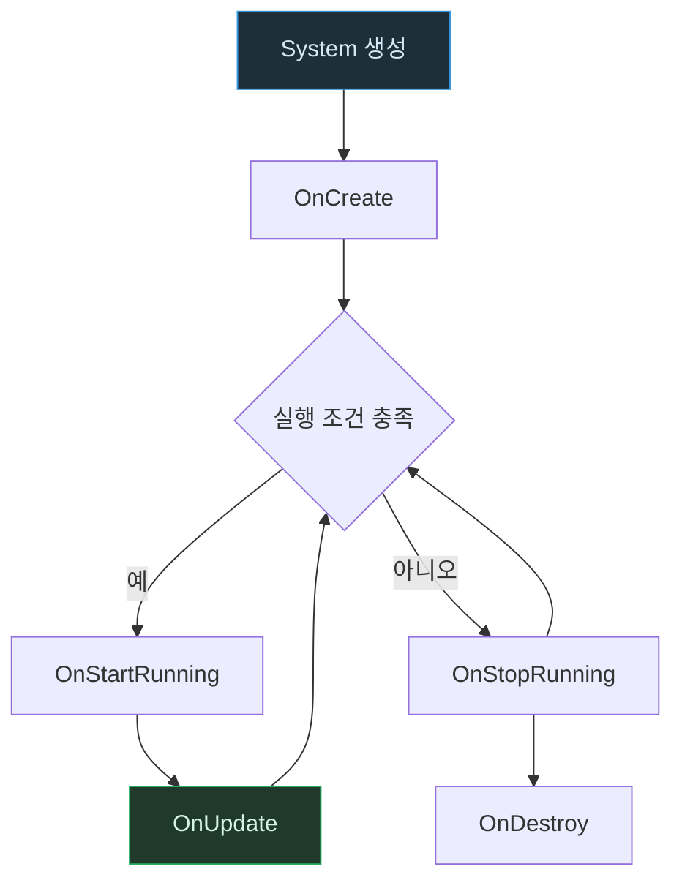

# System 생명주기: System은 언제 실제로 일하는가

기준: 2026-09-15, Entities 1.x 개념 기준.

**읽는 법**: 화살표는 System의 실행 상태 전이를 뜻한다. `실행 조건 충족`은 `RequireForUpdate`, query 매칭, System enabled 상태 등을 포함한다.

**핵심**: `OnCreate`가 호출되었다는 사실은 SubScene Entity나 pool이 준비되었다는 뜻이 아니다. 실제 게임 로직은 조건을 만족한 `OnUpdate`부터 시작한다.

