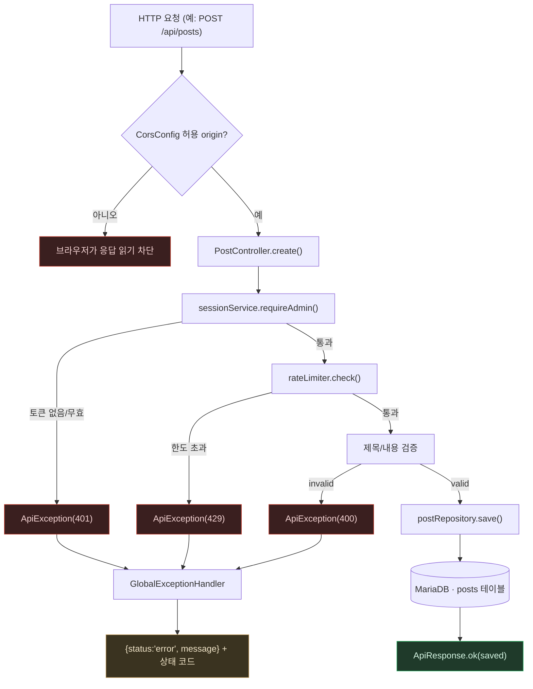

# Spring Boot — 요청 하나가 지나가는 경로

> `Spring-Boot.md`의 별첨 플로우차트. 작성 규칙은
> `DevelopPrompt/Unity/VISUALIZE_RULE/04_MERMAID_STYLE.md`를 따른다.
> 기준 시점: 2026-09-08

**읽는 법**: 컨트롤러 메서드 안에서 순서대로 일어나는 세 가지 방어(인증 → rate limit → 검증)
중 어디서든 실패하면 `ApiException`을 던지고, 그 예외들은 전부 한 곳(`GlobalExceptionHandler`)
으로 모여 같은 모양의 에러 응답으로 바뀐다(주황). CORS는 이보다 앞단, 프레임워크 레벨에서
걸러진다 — 컨트롤러 코드에 도달하기 전에 브라우저가 자체적으로 막는다(빨강, 서버 로그에도
안 남는 경우가 많다).

**핵심**: PHP 버전은 이 세 가지 방어를 각 파일 맨 위에 순서대로 나열해서 호출했다
(`allow_cors()` → `require_admin()` → `rate_limit_check()` → 검증). Spring 버전도 컨트롤러
메서드 안에서 겉보기엔 똑같은 순서로 호출하지만, 예외 처리 부분만 프레임워크가 한 곳으로
모아준다 — "무엇을 검사하는가"의 순서는 그대로 두고 "실패했을 때 응답을 어떻게 만드는가"만
프레임워크에 위임한 셈이다.
